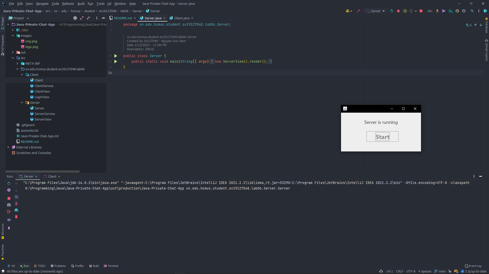
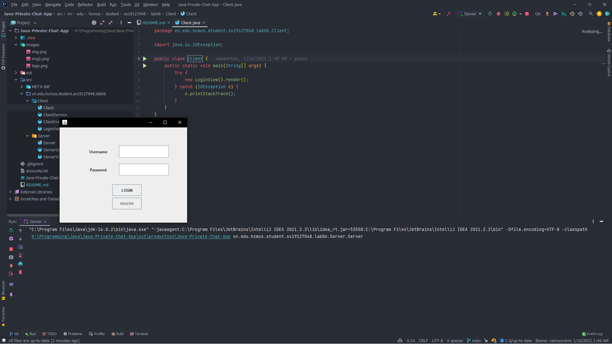
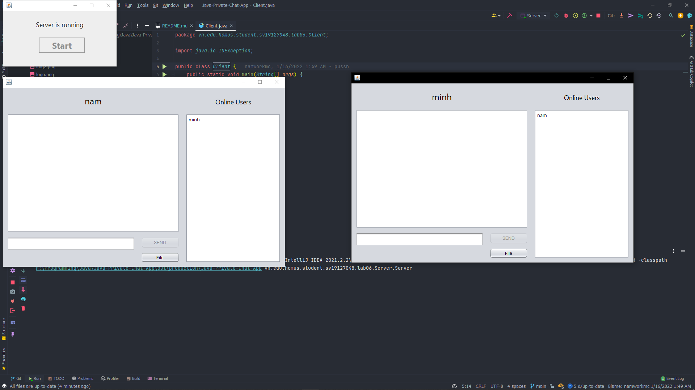

<div id="top"></div>
<!--
*** Thanks for checking out the Best-README-Template. If you have a suggestion
*** that would make this better, please fork the repo and create a pull request
*** or simply open an issue with the tag "enhancement".
*** Don't forget to give the project a star!
*** Thanks again! Now go create something AMAZING! :D
-->


<!-- PROJECT SHIELDS -->
<!--
*** I'm using markdown "reference style" links for readability.
*** Reference links are enclosed in brackets [ ] instead of parentheses ( ).
*** See the bottom of this document for the declaration of the reference variables
*** for contributors-url, forks-url, etc. This is an optional, concise syntax you may use.
*** https://www.markdownguide.org/basic-syntax/#reference-style-links
-->

[comment]: <> ([![Contributors][contributors-shield]][contributors-url])

[comment]: <> ([![Forks][forks-shield]][forks-url])

[comment]: <> ([![Stargazers][stars-shield]][stars-url])

[comment]: <> ([![Issues][issues-shield]][issues-url])

[comment]: <> ([![MIT License][license-shield]][license-url])

[comment]: <> ([![LinkedIn][linkedin-shield]][linkedin-url])


<!-- PROJECT LOGO -->
<br />
<div align="center">
  <a href="https://github.com/namworkmc/Project-A-star-Path-Finding">
    
  </a>

<h3 align="center">Java Chat Application</h3>

  <p align="center">
    Multiple users chat application project.
    <br />
    <br />
    <br />
  </p>
</div>


<!-- TABLE OF CONTENTS -->
<details>
  <summary>Table of Contents</summary>
  <ol>
    <li>
      <a href="#about-the-project">About The Project</a>
      <ul>
        <li><a href="#built-with">Built With</a></li>
      </ul>
    </li>
    <li>
      <a href="#getting-started">Getting Started</a>
      <ul>
        <li><a href="#prerequisites">Prerequisites</a></li>
        <li><a href="#installation">Installation</a></li>
      </ul>
    </li>
    <li><a href="#usage">Usage</a></li>
    <li><a href="#idea">Idea</a></li>
    <li><a href="#contact">Contact</a></li>
  </ol>
</details>


<!-- ABOUT THE PROJECT -->
<a id="about-the-project"></a>

## About The Project

[![Product Name Screen Shot][product-screenshot]]()

Project chat application, uses Java Swing to create the GUI. Project's features include:

- Registering and logging in
- Chatting with other users (online) at the same time
- Allows users to send and receive files

The project uses multithreading techniques to allow multiple users to chat and send file at the same time. Uses Socket
and IO streams to communicate with other users.

<a id="built-with"></a>

### Built With

Used only Java core:

- Java 8
- Java Swing
- Java IO
- Java Thread
- Java File
- Java Socket

<!-- GETTING STARTED -->
<a id="getting-started"></a>

## Getting Started

Download the project from [GitHub](https://github.com/namworkmc/Java-Private-Chat-App.git) and run the project.
**Remember to install JDK, JRE and configure JAVA_HOME environment variable.**

<a id="prerequisites"></a>

### Prerequisites

[Install JDK, JRE and configure JAVA_HOME environment variable.](https://youtu.be/IJ-PJbvJBGs)

<a id="installation"></a>

### Installation

1. Clone the repo
   ```sh
   git clone https://github.com/namworkmc/Java-Private-Chat-App.git
   ```
2. Run the project with your IDE. I am using IntelliJ IDEA.

<!-- USAGE EXAMPLES -->
<a id="usage"></a>

## Usage

You can find **.jar** files in jar folder.

1. Run Server.java and click "Start"
   
2. Run Client.java and login. If you don't have an account, click "Register"
   (If you need multiple Client you can use .jar file)
   
   

<!-- IDEA -->
<a id="idea"></a>

## Main Idea

### Server side
Use a **Thread** to handle multiple incoming clients, and it is called **ClientHandlerThread**. 
The **ClientHandlerThread** includes: **Socket**, **DataInputStream**, **DataOutputStream** for sending and receiving data;
**username** and **password** to identify the user; **isLogin** to check if the user is logged in.

Each client will be handled by a separate thread, these threads will be stored in a **HashMap** and the key will be the **username**.

### Client side
The main **Thread** will handle sending messages and files to other users.
Use a **Thread** to handle multiple incoming messages and files, and it is called **Receiver**.
The **Receiver** includes: DataInputStream for receiving data.

Other clients will be stored in a **HashMap** and the key will be the **username**.

Normal message will be sent as normal **String**, and file will be sent as **byte** array.
Text is sent using **writeUTF** and file is sent using **write**.
But the problem is the **Socket** is allowing only 65482 bytes at once so
the file needs to be sent in chunks.

<!-- CONTACT -->
<a id="contact"></a>

## Contact

Nguyễn Đức Nam - [@Facebook](https://www.facebook.com/DucNamHCMUS) - namworkmc@gmail.com<br>

Project
Link: [https://github.com/namworkmc/Java-Private-Chat-App](https://github.com/namworkmc/Java-Private-Chat-App)

<p align="right">(<a href="#top">back to top</a>)</p>


[contributors-shield]: https://img.shields.io/github/contributors/othneildrew/Best-README-Template.svg?style=for-the-badge

[contributors-url]: https://github.com/othneildrew/Best-README-Template/graphs/contributors

[forks-shield]: https://img.shields.io/github/forks/othneildrew/Best-README-Template.svg?style=for-the-badge

[forks-url]: https://github.com/othneildrew/Best-README-Template/network/members

[stars-shield]: https://img.shields.io/github/stars/othneildrew/Best-README-Template.svg?style=for-the-badge

[stars-url]: https://github.com/othneildrew/Best-README-Template/stargazers

[issues-shield]: https://img.shields.io/github/issues/othneildrew/Best-README-Template.svg?style=for-the-badge

[issues-url]: https://github.com/othneildrew/Best-README-Template/issues

[license-shield]: https://img.shields.io/github/license/othneildrew/Best-README-Template.svg?style=for-the-badge

[license-url]: https://github.com/othneildrew/Best-README-Template/blob/master/LICENSE.txt

[linkedin-shield]: https://img.shields.io/badge/-LinkedIn-black.svg?style=for-the-badge&logo=linkedin&colorB=555

[linkedin-url]: https://linkedin.com/in/othneildrew

[product-screenshot]: images/img.png
