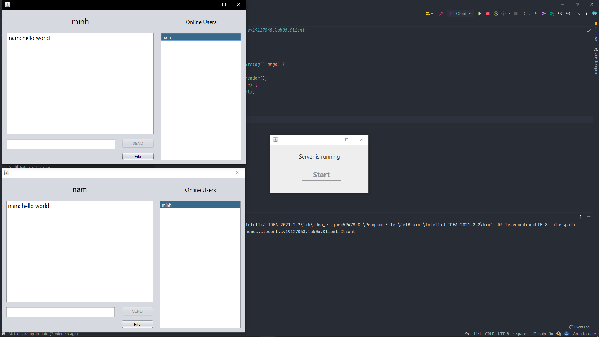

<div id="top"></div>
<!--
*** Thanks for checking out the Best-README-Template. If you have a suggestion
*** that would make this better, please fork the repo and create a pull request
*** or simply open an issue with the tag "enhancement".
*** Don't forget to give the project a star!
*** Thanks again! Now go create something AMAZING! :D
-->


<!-- PROJECT SHIELDS -->
<!--
*** I'm using markdown "reference style" links for readability.
*** Reference links are enclosed in brackets [ ] instead of parentheses ( ).
*** See the bottom of this document for the declaration of the reference variables
*** for contributors-url, forks-url, etc. This is an optional, concise syntax you may use.
*** https://www.markdownguide.org/basic-syntax/#reference-style-links
-->

[comment]: <> ([![Contributors][contributors-shield]][contributors-url])

[comment]: <> ([![Forks][forks-shield]][forks-url])

[comment]: <> ([![Stargazers][stars-shield]][stars-url])

[comment]: <> ([![Issues][issues-shield]][issues-url])

[comment]: <> ([![MIT License][license-shield]][license-url])

[comment]: <> ([![LinkedIn][linkedin-shield]][linkedin-url])


<!-- PROJECT LOGO -->
<br />
<div align="center">
  <a href="https://github.com/namworkmc/Project-A-star-Path-Finding">
    
  </a>

<h3 align="center">Java Chat Application</h3>

  <p align="center">
    Đồ án tìm đường đi tối ưu bằng thuật toán A*
    <br />
    <a href="https://github.com/namworkmc/Project-A-star-Path-Finding/tree/main/Report"><strong>Báo cáo tìm hiểu chủ đề tìm đường đi tối ưu »</strong></a>
    <br />
    <br />
  </p>
</div>


<!-- TABLE OF CONTENTS -->
<details>
  <summary>Table of Contents</summary>
  <ol>
    <li>
      <a href="#about-the-project">About The Project</a>
      <ul>
        <li><a href="#built-with">Built With</a></li>
      </ul>
    </li>
    <li>
      <a href="#getting-started">Getting Started</a>
      <ul>
        <li><a href="#prerequisites">Prerequisites</a></li>
        <li><a href="#installation">Installation</a></li>
      </ul>
    </li>
    <li><a href="#usage">Usage</a></li>
    <li><a href="#idea">Idea</a></li>
    <li><a href="#contact">Contact</a></li>
  </ol>
</details>


<!-- ABOUT THE PROJECT -->
<a id="about-the-project"></a>
## About The Project

[![Product Name Screen Shot][product-screenshot]]()

Project chat application, uses Java Swing to create the GUI. Project's features include:
- Registering and logging in
- Chatting with other users (online) at the same time
- Allows users to send and receive files

The project uses multithreading techniques to allow multiple users to chat and send file at the same time.
Uses Socket and IO streams to communicate with other users.

<a id="built-with"></a>
### Built With

Uses only Java. 

<!-- GETTING STARTED -->
<a id="getting-started"></a>
## Getting Started

Download the project from [GitHub](https://github.com/namworkmc/Java-Private-Chat-App.git) and run the project.
**Remember to install JDK, JRE and configure JAVA_HOME environment variable.**

<a id="prerequisites"></a>
### Prerequisites

[Install JDK, JRE and configure JAVA_HOME environment variable.](https://youtu.be/IJ-PJbvJBGs)

<a id="installation"></a>
### Installation

1. Clone the repo
   ```sh
   git clone https://github.com/namworkmc/Java-Private-Chat-App.git
   ```
2. Run the project with your IDE. I am using IntelliJ IDEA.

<!-- USAGE EXAMPLES -->
<a id="usage"></a>
## Usage
1. Run Server.java and click "Start"
   
2. Chạy code <br />
   
3. Chọn hàm Heuristic cho thuật toán <br />
   


<!-- IDEA -->
<a id="idea"></a>
## Ý tưởng của thuật toán và 3 hàm Heuristic tự sáng tạo

### Ý tưởng thuật toán
**_open_list_** là một Priority Queue (**_PQ_**) để lưu lại các toạ độ (node) đã đi qua và dùng để mở rộng (expand)
đường đi (các node chưa duyệt). Sử dụng giá trị Priority: f(n) = g(n) + h(n) (trị số **_P_**).

**_G_Score_** là một ma trận có kích thước với với ảnh đầu vào, giá trị khởi tạo của từng phần tử của ma
trận là **infinity** (đại diện cho node chưa duyệt qua), dùng để lưu giá trị g(n) của từng toạ độ.

**_Path_** là tập đường đi.

**_Thuật toán:_**<br>
Khởi tạo **_open_list_**, **_G_Score_**, **_Path_**

Khởi tạo vị trí bắt đầu (**start**) và cho vào **_G_Score_** với giá trị là **0**. Thêm **start** vào **_open_list_**
với trị số **_P_**. Bước tiếp theo, lấy phần tử có trị số **_P_** nhỏ nhất ra khỏi **_PQ_** gọi là current,
so sánh với vị trí kết thúc (**goal**), nếu trùng khớp kết thúc thuật toán.
Ngược lại, tạo list **_successor_** lưu lại toạ độ các điểm lân cận có thể đi qua.
Duyệt từng phần của tập **_successor_**, kiểm tra **cost** của **_successor_** bằng cách lấy g(n) của current
cộng với khoảng cách giữa **_successor_** đang xét và currentl. Nếu **cost** thấp hơn g(n) của **_successor_**, cập
nhật lại g(n) của **_successor_** = **cost**, tính h(n) theo công thức Heuristic đề xuất, thêm **_successor_** vào
**_open_list_** với trị số **_P_** = g(n) + h(n) của **_successor_**. Thực hiện lại các bước cho đến khi **_open_list_** rỗng.

### Ý tưởng của 3 hàm Heuristic
1. CustomManhattan
   Dựa trên ý tưởng khoảng cách Manhattan, công thức: <br>
   <br>
   Nhóm đã cộng thêm một tham số 𝑘 = |𝑚 − 𝐷(𝑎1, 𝑎2)| (trong đó m là hằng số để kiểm tra độ chênh lệch độ cao),
   sau đó cho 𝑘 = 𝑘 + 1 đến khi 𝑘 là một số nguyên tố. Sau đó ta có được hàm Heuristic:<br>
   <br>

2. CustomEuclid
   Tương tự như CustomManhattan, nhóm cũng dựa trên ý tưởng khoảng cách Euclid với công thức:<br>
   <br>
   Nhóm đã cộng thêm một tham số 𝑘 = |𝑚 − 𝐷(𝑎1, 𝑎2)| (trong đó m là hằng số để kiểm tra độ chênh lệch độ cao),
   sau đó cho 𝑘 = 𝑘 + 1 đến khi 𝑘 là một số nguyên tố. Sau đó ta có được hàm Heuristic:<br>
   


3. Circle Area
   Thuật toán A* khi expand node về phía goal theo hình Elip nên ý tưởng diện
   tích hình Elip làm hàm heuristic. Tuy nhiên để tính diện tích hình Elip sẽ khá phức
   tạp thay vào đó nhóm sử dụng công thức tính diện tích tương đối giống với Elip là hình tròn:<br>
   

<!-- MORE -->   
## Xem thêm report để biết thêm chi tiết
https://github.com/namworkmc/Project-A-star-Path-Finding/tree/main/Report

<!-- CONTACT -->
<a id="contact"></a>
## Contact

Nguyễn Đức Nam - [@Facebook](https://www.facebook.com/DucNamHCMUS) - namworkmc@gmail.com<br>
Lê Ngọc Minh Nhật - [@Facebook](https://www.facebook.com/profile.php?id=100050103259038) - 19127@gmail.com

Project Link: [https://github.com/namworkmc/Project-A-star-Path-Finding](https://github.com/namworkmc/Project-A-star-Path-Finding)

<p align="right">(<a href="#top">back to top</a>)</p>

<!-- MARKDOWN LINKS & IMAGES -->
<!-- https://www.markdownguide.org/basic-syntax/#reference-style-links -->
[contributors-shield]: https://img.shields.io/github/contributors/othneildrew/Best-README-Template.svg?style=for-the-badge
[contributors-url]: https://github.com/othneildrew/Best-README-Template/graphs/contributors
[forks-shield]: https://img.shields.io/github/forks/othneildrew/Best-README-Template.svg?style=for-the-badge
[forks-url]: https://github.com/othneildrew/Best-README-Template/network/members
[stars-shield]: https://img.shields.io/github/stars/othneildrew/Best-README-Template.svg?style=for-the-badge
[stars-url]: https://github.com/othneildrew/Best-README-Template/stargazers
[issues-shield]: https://img.shields.io/github/issues/othneildrew/Best-README-Template.svg?style=for-the-badge
[issues-url]: https://github.com/othneildrew/Best-README-Template/issues
[license-shield]: https://img.shields.io/github/license/othneildrew/Best-README-Template.svg?style=for-the-badge
[license-url]: https://github.com/othneildrew/Best-README-Template/blob/master/LICENSE.txt
[linkedin-shield]: https://img.shields.io/badge/-LinkedIn-black.svg?style=for-the-badge&logo=linkedin&colorB=555
[linkedin-url]: https://linkedin.com/in/othneildrew
[product-screenshot]: images/img.png
